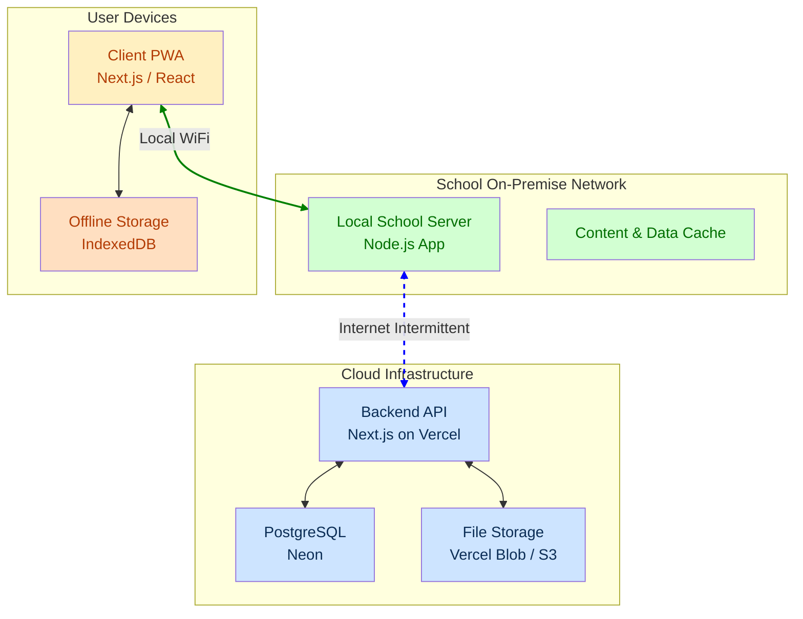

# 🏗️ TECHNICAL ARCHITECTURE DOCUMENT (V2) - SchoolBridge LMS

## 1. System Architecture Overview

The SchoolBridge V2 architecture is a **three-tiered, offline-first system** designed for resilience and performance in variable connectivity environments. It consists of the Client, the Local School Server, and the Cloud Backend.

### Architectural Layers:

1.  **Client (PWA):** A Progressive Web App running on user devices (tablets, laptops). It holds a local copy of data in IndexedDB, allowing full application functionality while offline. It prioritizes connecting to the Local School Server if available.
2.  **Local School Server:** An on-premise server within the school. It acts as a high-speed local cache for content and a data aggregator. It serves the PWA to local clients and synchronizes data with the Cloud Backend when an internet connection is present.
3.  **Cloud Backend:** The central source of truth, hosted on Vercel and Neon. It holds the master database, handles authentication, and manages the overall system.

---

## 2. Data Layer & Schema

The data layer is the heart of the LMS, designed using a relational model to ensure data integrity and scalability.

-   **Technology:** PostgreSQL
-   **ORM:** Prisma
-   **Canonical Schema:** The single source of truth for the data model is documented in `docs/v2/new_database_schema.md`, with a visual representation available in `docs/v2/database_diagram.md`.

### Schema Modules Overview

The schema is organized into several logical domains:

1.  **Course Management:** The core of the LMS. `Course` is the central model, linked to `Category`, `Instructor`, `Section`, and `Lecture`. This domain defines the structure and metadata of all educational content.
2.  **Content Types:** Polymorphic-style content models linked to a `Lecture`. A lecture can be a `Video`, `Article`, `Quiz`, `Assignment`, etc. This allows for a flexible and extensible content strategy.
3.  **User & Profiles:** A central `User` model handles authentication and core identity. Specific roles and their associated data are managed in separate profile models (`Student`, `Parent`, `Instructor`, `Admin`), linked 1-to-1 with the User. The `Account` model is introduced to manage links to external authentication providers (e.g., OAuth), allowing flexible login options. This avoids a bloated, sparse User table and allows for clean, role-specific logic.
4.  **Messaging System:** This new domain introduces models for `Conversation`, `Message`, `ConversationParticipant`, and `MessageReadStatus`. It supports direct, group, and crucially, contextual conversations linked to specific `Course`s or `Lecture`s, fostering focused discussions around learning materials.
5.  **School & Enrollments:** This domain models the real-world school structure. `School` is the top-level tenant. Each school has `Classes`, `AcademicPeriod`s, and `ClassEnrollment` records linking Students to Classes. `CourseEnrollment` links Students to Courses.
5.  **Assessment & Progress:** This domain tracks student learning. `LectureProgress` records completion status at the most granular level. `QuizAttempt` and `AssignmentSubmission` store student work, which is then evaluated and recorded in the `Grade` model.
6.  **Offline & Network Infrastructure:** This is the key to the offline-first strategy.
    -   `SchoolServer`: Defines the on-premise servers.
    -   `ContentCache`: A manifest of content stored on a `SchoolServer`.
    -   `DownloadQueue` & `OfflineContent`: Manage content downloaded to the client PWA.
    -   `ContentVariant`: Stores information about different quality versions of the same content (e.g., 360p, 720p, 1080p videos) to save bandwidth.

---

## 3. Offline & Synchronization Architecture

This is the most critical and complex part of the system. The goal is to make the application feel fast and reliable, regardless of network status.

### Client-Side (PWA)

-   **Storage:**
    -   **IndexedDB:** Used as a client-side database to store a subset of the application's data (e.g., downloaded courses, user progress, queued mutations). Libraries like `dexie.js` will be used to simplify interactions.
    -   **Cache API:** Used by the Service Worker to cache static assets (JS, CSS, images) and application shell, enabling instant loads.
-   **Service Worker:**
    -   **Offline Mode:** Intercepts all outgoing `fetch` requests. If the device is offline or the request fails, it serves data from the IndexedDB cache if available.
    -   **Background Sync:** Manages the synchronization of data with the Local School Server (or Cloud) in the background, even if the user closes the app.
-   **Offline Mutation Queue:**
    -   When a user performs a write action offline (e.g., completes a quiz, creates a note), the action is serialized and stored in an IndexedDB queue.
    -   When connectivity is restored, the Service Worker sends these queued mutations to the server for processing.

### Local School Server

-   **Role:** A vital intermediary that provides a fast, local "cloud" experience.
-   **Technology:** A lightweight Node.js application (e.g., using Express or Fastify) with its own database (potentially SQLite or a local PostgreSQL instance) to manage the cache state.
-   **Responsibilities:**
    1.  **Content Caching:** Proactively pulls course content from the Cloud based on `CachePriority` and school needs. Serves this content directly to local clients at high speed.
    2.  **Data Aggregation:** Accepts mutations from multiple clients on the local network. It aggregates these changes before syncing them to the cloud, reducing the number of cloud connections.
    3.  **Sync Proxy:** Manages the synchronization process with the Cloud Backend, handling intermittent internet connectivity with retry logic and exponential backoff.

### Synchronization Logic & Conflict Resolution

-   **Data Flow:** The primary data flow is **Client ↔ Local Server ↔ Cloud**. Clients should not talk directly to the cloud if a local server is available.
-   **Delta Sync:** Only changes since the last successful sync are transmitted to conserve bandwidth. Timestamps and version numbers on records are used to determine what has changed.
-   **Conflict Resolution:** Conflicts are inevitable (e.g., a teacher updates a grade on the cloud while a student's progress syncs from a local server). The resolution strategy is hierarchical:
    1.  **Role-Based Priority:** Certain roles can always overwrite data from lower-priority roles (e.g., an Admin's change to a user profile overrides the user's own change).
    2.  **Operational Logic:** Some conflicts can be resolved logically (e.g., `timeSpent` on a lecture can be merged additively).
    3.  **Last-Write-Wins (Timestamp):** For simple data where priority doesn't matter, the most recent change wins.
    4.  **Manual Resolution:** In rare, critical cases (e.g., conflicting grade entries from two different teachers), a conflict is flagged for manual review by an Admin.

---

## 4. Backend & API Design

-   **Technology:** Next.js API Routes, deployed as serverless functions on Vercel for scalability and ease of use.
-   **API Style:** A pragmatic RESTful approach. Resources are exposed via clear, noun-based URLs, and standard HTTP verbs (`GET`, `POST`, `PUT`, `DELETE`) are used.
-   **Key API Endpoint Groups:**
    -   `/api/auth/*`: User authentication and session management.
    -   `/api/courses/*`: Full CRUD for courses, sections, lectures, and related content.
    -   `/api/enrollments/*`: Managing student enrollments in courses and classes.
    -   `/api/grades/*`: Submitting and retrieving grades.
    -   `/api/sync/*`: Endpoints for the synchronization of data from clients and local servers.
    -   `/api/school-server/*`: Endpoints for local servers to register themselves and manage sync processes.
    -   `/api/users/*`: User and profile management.

---

## 5. Authentication & Authorization

-   **Authentication:**
    -   **Provider:** `next-auth`
    -   **Strategy:** JSON Web Tokens (JWT). A short-lived access token is used for API requests, and a long-lived refresh token is used to obtain new access tokens without requiring the user to log in again. The `Account` model is used to link users to various external authentication providers.
    -   **Storage:** Tokens are stored in secure, `HttpOnly` cookies.
-   **Authorization (RBAC):**
    -   Access control is enforced at multiple levels (middleware, API routes, frontend components).
    -   When a user logs in, their JWT is populated with their core `id` and `role` (e.g., `STUDENT`, `INSTRUCTOR`).
    -   API middleware validates the JWT and fetches the user's detailed profile (`Student`, `Instructor`, etc.) to check for specific permissions before allowing the request to proceed.
    -   Example: A request to `POST /api/courses` would require a user with the `INSTRUCTOR` role. A request to `PUT /api/courses/:id/validate` would require an `EDUCATIONAL_MANAGER`.

### Implemented Features: User & Account Management Enhancements

The following features have been implemented to enhance User & Account Management, focusing on secure authentication, robust lockout mechanisms, and flexible administrative controls:

#### 5.1. Enhanced Authentication Flow

*   **Email/Password Registration with OTP:**
    *   New users registering with Email/Password now undergo an OTP verification step via email.
    *   An API route (`/api/register`) handles OTP generation and `PendingRegistration` creation (`prisma/schema.prisma`).
    *   A dedicated frontend page (`/register/verify-otp`) and API route (`/api/register/verify-otp`) manage OTP submission and final user creation.
    *   A resend OTP mechanism (`/api/register/resend-otp`) is in place for convenience.
*   **Google Authentication for New Users:**
    *   New users signing up or logging in via Google Auth, whose emails are not pre-associated with other specific roles, are automatically assigned a default `STUDENT` role.
    *   A corresponding `Student` profile is created for them, and they are directed to a read-only Student Dashboard.
    *   The `signIn` callback in `src/auth.ts` handles this logic, ensuring proper role and profile assignment during Google Auth.

#### 5.2. Robust Account Lockout Mechanism

*   **Login Failure Policy:** User accounts are locked after 5 consecutive failed login attempts to prevent brute-force attacks.
*   **Lockout Duration:** Locked accounts remain inaccessible for a period of 1 hour.
*   **Admin Override:** Authorized administrators (School Admin or Super Admin) possess the capability to manually unlock accounts.
*   **Implementation Details:** This mechanism is handled within the `CredentialsProvider` in `src/auth.ts` by updating the `failedLoginAttempts` and `lockedUntil` fields in the `User` model.

#### 5.3. Admin Controls for Authentication Features

*   **School-wide OTP Toggle:**
    *   Administrators (School Admin or Super Admin) can enable or disable the OTP requirement for new user registrations across their entire school.
    *   This setting is configurable via the `otpEnabled` field in the `SchoolConfig` model (`prisma/schema.prisma`).
    *   A dedicated backend API (`/api/admin/school-settings/[schoolId]`) facilitates fetching and updating this setting.
    *   An Admin UI page (`/dashboard/admin/schools/[schoolId]/settings`) provides a user-friendly toggle switch for this feature. By default, OTP is enabled for new schools.
*   **Manual Account Unlock:**
    *   Administrators (School Admin or Super Admin) are empowered to manually unlock user accounts that have been locked due to excessive failed login attempts.
    *   A dedicated backend API endpoint (`/api/admin/users/[userId]/unlock`) handles the resetting of `failedLoginAttempts` and `lockedUntil` for a specified user.
    *   The `UserTable` component within the Admin UI (`/dashboard/admin/users`) has been enhanced to display user lockout status and includes an "Unlock User" action for locked accounts, providing granular control to administrators.

---

## 6. Frontend Architecture

-   **Framework:** Next.js 14 (App Router) with TypeScript.
-   **UI Library:** `shadcn/ui` for accessible, unstyled components, combined with `Tailwind CSS` for styling.
-   **State Management:**
    -   **Global State:** `Zustand` for small, shared state like authentication status, UI theme, or sync status.
    -   **Server State:** `TanStack Query` (React Query) for fetching, caching, and synchronizing data from the API. It is instrumental in providing an optimistic UI, where changes appear instantly and are later reconciled with the server.
-   **PWA:** The application will be a full-featured Progressive Web App, using a `manifest.json` and a Service Worker to be installable and work offline.

---

## 7. Monitoring & Observability

-   **Error Tracking:** Sentry will be used for real-time error tracking on the client, local server, and cloud backend. Source maps will be uploaded to de-minify production stack traces.
-   **Performance Monitoring:**
    -   **Frontend:** Vercel Analytics to track Core Web Vitals and page performance.
    -   **Backend:** Vercel's function monitoring to track API response times and error rates.
-   **System Health:**
    -   A dedicated status endpoint (`/api/health`) will be used to check the health of the API and database connection.
    -   Local School Servers will have their own health check endpoint and will periodically "ping" the cloud to report their status. Custom dashboards will be needed to visualize the health of the entire fleet of local servers.
-   **Logging:** Structured logging (JSON) will be used across all tiers. Logs from local servers will be batched and sent to the cloud during sync operations for centralized analysis.

---

🗺️ **Next Document:** Development Roadmap & Sprint Planning
