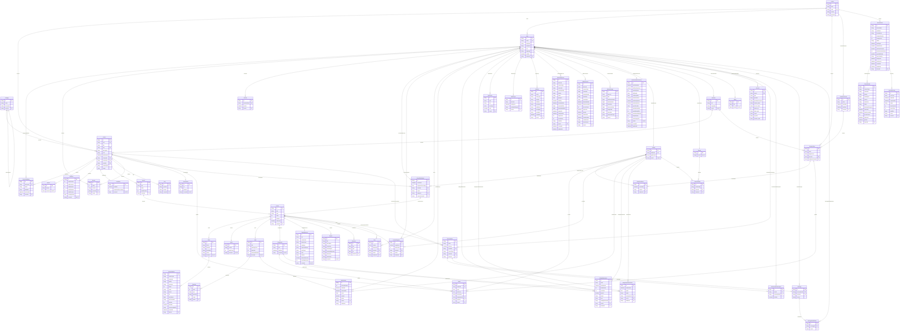

# Database Schema Diagram

This document contains the Entity Relationship Diagram (ERD) for the database, generated in Mermaid syntax.

```mermaid
erDiagram

  %% ========== COURSE MANAGEMENT ==========

  Course {
    string id PK
    string uuid UK
    string title
    string slug UK
    string description
    string level
    datetime publishedAt
    string categoryId FK
    string instructorId FK
    string schoolId FK
    string contentType
    string status
  }

  CourseValidation {
    string id PK
    string reviewerId FK
    string status
    string feedback
    datetime reviewedAt
    string courseId FK
  }

  Version {
    string id PK
    string current
    string courseId UK, FK
  }

  Category {
    string id PK
    string name
    string description
    string parentId FK
  }

  Statistics {
    string id PK
    int totalSections
    int totalLectures
    int totalDuration
    int totalStudents
    int totalReviews
    float averageRating
    string courseId UK, FK
  }

  Certificate {
    string id PK
    boolean available
    int completionPercentage
    string courseId UK, FK
  }

  Section {
    string id PK
    string title
    int order
    int totalDuration
    string courseId FK
  }

  Lecture {
    string id PK
    string title
    string type
    int order
    int duration
    boolean isPreview
    string sectionId FK
  }

  Video {
    string id PK
    string hlsUrl
    string dashUrl
    string thumbnail
    string status
    string lectureId UK, FK
  }

  Article {
    string id PK
    string content
    int wordCount
    string lectureId UK, FK
  }

  Quiz {
    string id PK
    string title
    int passingScore
    int timeLimit
    int attemptsAllowed
    string lectureId UK, FK
  }

  Question {
    string id PK
    int order
    string type
    string question
    int points
    string quizId FK
  }

  QuizAttempt {
    string id PK
    int attemptNumber
    datetime startedAt
    datetime submittedAt
    float score
    boolean passed
    string quizId FK
    string userId FK
    string studentId FK
  }

  CodingExercise {
    string id PK
    string title
    string instructions
    string starterCode
    string language
    string expectedOutput
    string testCases
    string hints
    string solution
    boolean allowSubmission
    int maxSubmissions
    string lectureId UK, FK
  }

  CodingSubmission {
    string id PK
    string code
    datetime submittedAt
    int testsPassed
    int testsTotal
    boolean passed
    string output
    string error
    string codingExerciseId FK
    string userId FK
    string studentId FK
  }

  Assignment {
    string id PK
    string title
    datetime dueDate
    string lectureId UK, FK
  }

  AssignmentSubmission {
    string id PK
    datetime submittedAt
    float grade
    string status
    string assignmentId FK
    string userId FK
    string studentId FK
  }

  Project {
    string id PK
    string title
    string description
    string complexity
    string technologies
    string learningObjectives
    string milestones
    string submission
    string lectureId UK, FK
  }

  Resource {
    string id PK
    string title
    string type
    string url
    string lectureId FK
  }

  FAQ {
    string id PK
    string question
    string answer
    string courseId FK
  }

  Review {
    string id PK
    int rating
    string content
    string courseId FK
    string userId FK
  }

  PromoVideo {
    string id PK
    string url
    int duration
    string courseId UK, FK
  }

  %% ========== CORE USER MANAGEMENT ==========

  User {
    string id PK
    string email UK
    string firstName
    string lastName
    string role
    string language
    boolean verified
    string schoolId FK
  }

  Account {
    string id PK
    string userId FK
    string type
    string provider
    string providerAccountId
    string refresh_token
    string access_token
    int expires_at
    string token_type
    string scope
    string id_token
    string session_state
  }

  Session {
    string id PK
    string sessionToken UK
    datetime expires
    string userId FK
  }

  %% ========== SCHOOL MANAGEMENT ==========

  School {
    string id PK
    string name
    string code UK
    string country
    string timezone
  }

  Grade {
    string id PK
    string studentId FK
    float score
    float maxScore
    string letterGrade
    string assignmentId FK
    string courseId FK
    string classId FK
  }

  AcademicPeriod {
    string id PK
    string name
    datetime startDate
    datetime endDate
    string schoolId FK
  }

  %% ========== PROFILE MODELS ==========

  Student {
    string id PK
    string studentId UK
    string gradeLevel
    string userId UK, FK
  }

  Instructor {
    string id PK
    string title
    string biography
    string userId UK, FK
  }

  Parent {
    string id PK
    string userId UK, FK
  }

  ParentStudent {
    string id PK
    string relationship
    string parentId FK
    string studentId FK
  }

  Admin {
    string id PK
    string role
    string userId UK, FK
  }

  %% ========== CLASS & ENROLLMENT ==========

  StudentClass {
    string id PK
    string name
    string degreeLevel
    string schoolId FK
    string academicPeriodId FK
  }

  ClassEnrollment {
    string id PK
    datetime enrolledAt
    string classId FK
    string studentId FK
  }

  CourseEnrollment {
    string id PK
    datetime enrolledAt
    float progressPercentage
    string courseId FK
    string userId FK
    string studentId FK
    string currentLectureId FK
  }

  %% ========== PROGRESS TRACKING & OTHERS ==========

  LectureProgress {
    string id PK
    boolean completed
    int lastPosition
    string lectureId FK
    string userId FK
    string studentId FK
  }

  Note {
    string id PK
    string content
    int timestamp
    string lectureId FK
    string userId FK
    string studentId FK
  }

  OfflineSync {
    string id PK
    string deviceId
    datetime lastSyncAt
    string pendingChanges
    string userId FK
  }

  AuditLog {
    string id PK
    string action
    string entityType
    string entityId
    string oldValue
    string newValue
    string ipAddress
    string userAgent
    string metadata
    datetime createdAt
    string userId FK
  }

  Notification {
    string id PK
    string type
    string title
    string message
    boolean read
    string userId FK
  }

  %% ========== SCHOOL NETWORK INFRASTRUCTURE ==========

  SchoolServer {
    string id PK
    string serverName
    string ipAddress
    string macAddress
    int storageCapacity
    int storageUsed
    string status
    datetime lastPingAt
    boolean isMainServer
    boolean canServeContent
    int maxConcurrentUsers
    boolean syncWithCloud
    string syncSchedule
    datetime lastSyncAt
    datetime nextSyncAt
    datetime createdAt
    datetime updatedAt
    string schoolId FK
  }

  ContentCache {
    string id PK
    string contentType
    string contentId
    string priority
    bigint sizeInBytes
    string version
    string checksum
    string status
    float downloadProgress
    datetime cachedAt
    datetime lastAccessedAt
    int accessCount
    datetime expiresAt
    boolean pinned
    string serverId FK
  }

  ServerSyncLog {
    string id PK
    string syncType
    datetime startedAt
    datetime completedAt
    string status
    int itemsSynced
    int itemsFailed
    bigint totalSize
    string errors
    string serverId FK
  }

  %% ========== BANDWIDTH-CONSCIOUS CONTENT ==========

  ContentVariant {
    string id PK
    string contentType
    string contentId
    string quality
    string resolution
    int bitrate
    string codec
    string format
    string url
    bigint sizeInBytes
    string sizeFormatted
    int duration
    boolean isDefault
    string recommendedFor
    datetime createdAt
    string videoId FK
  }

  DownloadQueue {
    string id PK
    string deviceId
    string contentType
    string contentId
    string variantQuality
    string priority
    string status
    float progress
    boolean wifiOnly
    datetime scheduledFor
    bigint estimatedSize
    bigint downloadedSize
    datetime startedAt
    datetime completedAt
    int retryCount
    int maxRetries
    string lastError
    string userId FK
    datetime createdAt
    datetime updatedAt
  }

  OfflineContent {
    string id PK
    string deviceId
    string contentType
    string contentId
    string variantQuality
    string localPath
    bigint sizeInBytes
    datetime downloadedAt
    datetime lastAccessedAt
    int accessCount
    datetime expiresAt
    boolean pinned
    boolean autoDelete
    boolean needsUpdate
    string cloudVersion
    string localVersion
    string userId FK
  }

  NetworkUsage {
    string id PK
    string deviceId
    datetime date
    bigint dataDownloaded
    bigint dataUploaded
    bigint videoData
    bigint documentData
    bigint imageData
    bigint otherData
    string connectionType
    string userId FK
  }

  UserNetworkPreference {
    string id PK
    boolean autoDownload
    boolean wifiOnlyDownload
    int maxDailyData
    string wifiQuality
    string cellularQuality
    boolean prioritizeVideos
    boolean prioritizeQuizzes
    boolean prioritizeArticles
    string syncSchedule
    int syncWindowStart
    int syncWindowEnd
    boolean autoDeleteWatched
    int keepDuration
    int maxStorageGB
    string userId UK, FK
    datetime createdAt
    datetime updatedAt
  }

  %% ========== MESSAGING ==========

  Conversation {
    string id PK
    string name
    boolean isGroup
    string creatorId FK
    string contextType
    string courseId FK
    string lectureId FK
  }

  ConversationParticipant {
    string id PK
    string userId FK
    string conversationId FK
    boolean isAdmin
  }

  Message {
    string id PK
    string conversationId FK
    string senderId FK
    string content
  }

  MessageReadStatus {
    string id PK
    string messageId FK
    string userId FK
  }


  %% ========== RELATIONSHIPS ==========

  Course                           ||--o{ CourseValidation      : "validations"
  Course                           ||--o| Version               : "version"
  Course                           ||--o| Statistics            : "statistics"
  Course                           ||--o| Certificate           : "certificates"
  Course                           ||--o{ Section               : "sections"
  Course                           ||--o{ FAQ                   : "faqs"
  Course                           ||--o{ Review                : "reviews"
  Course                           ||--o{ CourseEnrollment      : "enrollments"
  Course                           ||--o| PromoVideo            : "promoVideo"
  Course                           ||--o{ Grade                 : "grades"
  Course                           ||--o{ Conversation          : "CourseConversations"
  Category                         ||--o{ Course                : "courses"
  Category                         o|--o| Category              : "subcategories"
  Instructor                       ||--o{ Course                : "courses"
  School                           ||--o{ Course                : "courses"
  Section                          ||--o{ Lecture               : "lectures"
  Lecture                          ||--o| Video                 : "video"
  Lecture                          ||--o| Article               : "article"
  Lecture                          ||--o| Quiz                  : "quiz"
  Lecture                          ||--o| Assignment            : "assignment"
  Lecture                          ||--o| CodingExercise        : "codingExercise"
  Lecture                          ||--o| Project               : "project"
  Lecture                          ||--o{ Resource              : "resources"
  Lecture                          ||--o{ LectureProgress       : "progress"
  Lecture                          ||--o{ Note                  : "notes"
  Lecture                          ||--o{ Conversation          : "LectureConversations"
  Quiz                             ||--o{ Question              : "questions"
  Quiz                             ||--o{ QuizAttempt           : "attempts"
  CodingExercise                   ||--o{ CodingSubmission      : "submissions"
  Assignment                       ||--o{ Grade                 : "grades"
  Assignment                       ||--o{ AssignmentSubmission  : "submissions"
  User                             ||--o{ CourseValidation      : "courseValidations"
  User                             ||--o{ Review                : "reviews"
  User                             ||--o{ Session               : "sessions"
  User                             ||--o{ CourseEnrollment      : "courseEnrollments"
  User                             ||--o{ LectureProgress       : "lectureProgress"
  User                             ||--o{ Note                  : "notes"
  User                             ||--o{ QuizAttempt           : "quizAttempts"
  User                             ||--o{ CodingSubmission      : "codingSubmissions"
  User                             ||--o{ AssignmentSubmission  : "assignmentSubmissions"
  User                             ||--o{ Notification          : "notifications"
  User                             ||--o{ OfflineSync           : "offlineSyncs"
  User                             ||--o{ AuditLog              : "auditLogs"
  User                             ||--o{ DownloadQueue         : "downloadQueues"
  User                             ||--o{ OfflineContent        : "offlineContents"
  User                             ||--o{ NetworkUsage          : "networkUsages"
  User                             ||--o| UserNetworkPreference : "networkPreference"
  User                             ||--o| Student               : "studentProfile"
  User                             ||--o| Parent                : "parentProfile"
  User                             ||--o| Instructor            : "instructorProfile"
  User                             ||--o| Admin                 : "administratorProfile"
  User                             ||--o{ Account               : "accounts"
  School                           ||--o{ User                  : "users"
  School                           ||--o{ StudentClass            : "classes"
  School                           ||--o{ AcademicPeriod        : "academicPeriods"
  School                           ||--o{ SchoolServer          : "servers"
  Student                          ||--o{ Grade                 : "grades"
  Student                          ||--o{ ClassEnrollment       : "classEnrollments"
  Student                          ||--o{ CourseEnrollment      : "enrollments"
  Student                          ||--o{ LectureProgress       : "progress"
  Student                          ||--o{ QuizAttempt           : "quizAttempts"
  Student                          ||--o{ CodingSubmission      : "codingSubmissions"
  Student                          ||--o{ AssignmentSubmission  : "submissions"
  Parent                           ||--o{ ParentStudent         : "children"
  Student                          ||--o{ ParentStudent         : "parents"
  StudentClass                     ||--o{ ClassEnrollment       : "enrollments"
  StudentClass                     ||--o{ Grade                 : "grades"
  AcademicPeriod                   ||--o{ StudentClass            : "classes"
  Instructor                       ||--o{ StudentClass            : "classes"
  CourseEnrollment                 }|--o| Lecture               : "currentLecture"
  SchoolServer                     ||--o{ ContentCache          : "cachedContent"
  SchoolServer                     ||--o{ ServerSyncLog         : "syncLogs"
  Video                            ||--o{ ContentVariant        : "variants"

  %% Messaging Relationships
  User                             ||--o{ Conversation          : "CreatedConversations"
  User                             ||--o{ ConversationParticipant : "conversationParticipants"
  User                             ||--o{ Message               : "SentMessages"
  User                             ||--o{ MessageReadStatus     : "messageReadStatuses"
  Conversation                     ||--o{ ConversationParticipant : "participants"
  Conversation                     ||--o{ Message               : "messages"
  Message                          ||--o{ MessageReadStatus     : "readStatus"

```
