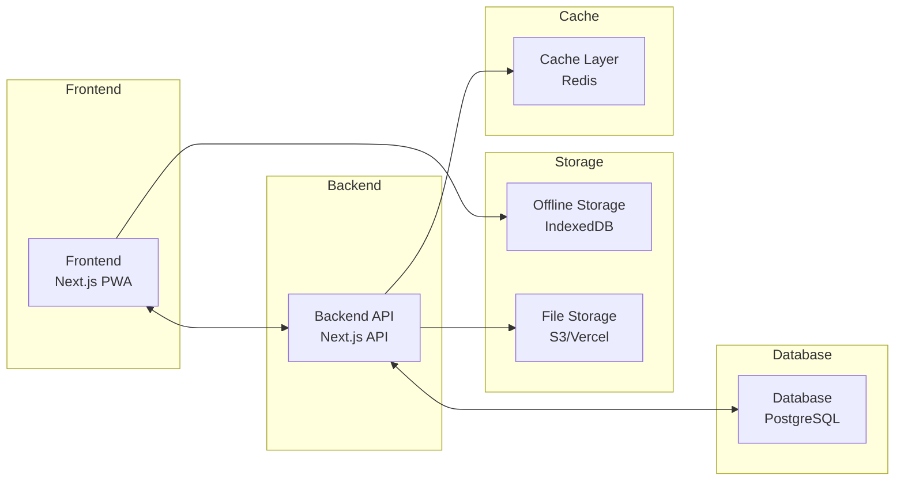

# 🏗️ TECHNICAL ARCHITECTURE DOCUMENT - SchoolBridge

## 1. System Architecture Overview

High-Level Architecture:



## 2. Database Schema Design

### Core Tables:

- Users & Authentication

```sql
users
├── id (UUID, PK)
├── email
├── phone
├── role (admin, teacher, student, parent)
├── school_id (FK)
├── language_preference (fr, en)
├── verification_code
├── is_verified
└── created_at

user_relationships
├── parent_id (FK → users)
├── student_id (FK → users)
└── is_verified
```

- Schools & Multi-tenancy

```sql
schools
├── id (UUID, PK)
├── name
├── config (JSONB) - download permissions, content rules
└── created_at

school_configs
├── school_id (FK)
├── allow_video_download (boolean)
├── allow_pdf_download (boolean)
├── allow_interactive_download (boolean)
└── sync_frequency_hours (integer)
```

- Course Management

```sql
courses
├── id (UUID, PK)
├── title
├── description
├── teacher_id (FK → users)
├── school_id (FK)
├── status (draft, under_review, approved, published)
├── language (fr, en, mg, es)
├── content_type (interactive, video, pdf, text)
├── requires_online (boolean)
├── file_size_bytes
└── validation_workflow (JSONB)

course_validation
├── id (UUID, PK)
├── course_id (FK)
├── reviewer_id (FK → users)
├── feedback_text
├── status (approved, changes_requested)
├── suggestions (JSONB)
└── reviewed_at

course_content
├── id (UUID, PK)
├── course_id (FK)
├── content_order (integer)
├── content_type (text, video, quiz, interactive)
├── content_data (JSONB) - structured content
├── appears_after_seconds (integer)
├── disappears_after_seconds (integer)
├── file_reference (string) - S3 path if applicable
└── offline_available (boolean)
```

- Parent-Teacher Communication

```sql
parent_instructions
├── id (UUID, PK)
├── teacher_id (FK → users)
├── student_id (FK → users)
├── instruction_text
├── is_urgent (boolean)
├── created_at
└── expires_at

parent_instruction_completions
├── id (UUID, PK)
├── instruction_id (FK)
├── parent_id (FK → users)
├── completed_at
├── status (completed, skipped, needs_help)
└── notes
```

- Progress & Skills Tracking

```sql
student_progress
├── id (UUID, PK)
├── student_id (FK → users)
├── course_id (FK)
├── completion_percentage
├── time_spent_minutes
├── last_accessed
└── current_module

skill_mastery
├── id (UUID, PK)
├── student_id (FK → users)
├── skill_id (FK → skills)
├── mastery_level (0-100)
├── badges_earned (JSONB)
└── updated_at

badges
├── id (UUID, PK)
├── name
├── description
├── icon_url
├── skill_requirement (JSONB)
└── category
```

## 3. API Design (REST)

- Authentication Endpoints:

```
POST /api/auth/register
POST /api/auth/verify
POST /api/auth/login
POST /api/auth/logout
```

- Course Management Endpoints:

```
GET    /api/courses                    # List courses (with filters)
POST   /api/courses                    # Create new course
GET    /api/courses/:id                # Get course details
PUT    /api/courses/:id                # Update course
POST   /api/courses/:id/submit-review  # Submit for validation
POST   /api/courses/:id/validate       # Validate course (admin/responsable)
GET    /api/courses/:id/download       # Download course package
```

- Validation Workflow Endpoints:

```
GET    /api/courses/:id/feedback       # Get feedback
POST   /api/courses/:id/feedback       # Add feedback/suggestions
PUT    /api/courses/:id/status         # Update course status
```

- Parent Communication Endpoints:

```
GET    /api/parent/instructions        # Get instructions for my children
POST   /api/teacher/instructions       # Create instructions for parents
PUT    /api/instructions/:id/complete  # Mark instruction as completed
GET    /api/instructions/completion    # Get completion analytics
```

- Offline Sync Endpoints:

```
POST   /api/sync/check                 # Check for updates
POST   /api/sync/push                  # Push local changes
POST   /api/sync/pull                  # Pull latest changes
GET    /api/sync/status                # Get sync status
```

## 4. Offline Synchronization Strategy

### Sync Architecture

```typescript
interface SyncPayload {
  deviceId: string;
  userId: string;
  lastSync: string; // ISO timestamp
  changes: {
    tables: {
      [table: string]: {
        created: Record<string, any>[];
        updated: Record<string, any>[];
        deleted: string[]; // IDs only
      }
    }
  };
  checksums: Record<string, string>; // For integrity verification
}

interface SyncResponse {
  serverTime: string;
  changes: SyncPayload['changes'];
  conflicts: ConflictResolution[];
  syncToken: string; // For next sync
  requiresFullSync: boolean; // If delta sync fails
}

interface ConflictResolution {
  table: string;
  recordId: string;
  conflictType: 'UPDATE_UPDATE' | 'UPDATE_DELETE' | 'DELETE_UPDATE';
  localValue: any;
  serverValue: any;
  resolution: 'SERVER_WINS' | 'CLIENT_WINS' | 'MANUAL_REQUIRED';
  reason: string;
}
```

### Delta Sync Implementation

```typescript
class OfflineSyncManager {
  // Only sync changes since last successful sync
  async deltaSync(lastSyncToken: string): Promise<SyncResult> {
    const changes = await this.getLocalChanges(lastSyncToken);
    const compressed = await this.compressPayload(changes);

    const response = await this.sendWithRetry(compressed, {
      retries: 3,
      backoff: 'exponential'
    });

    return this.applyServerChanges(response);
  }

  // Resume interrupted downloads
  async resumeDownload(downloadId: string): Promise<void> {
    const state = await this.getDownloadState(downloadId);
    const chunks = await this.downloadChunks(
      state.url,
      state.completedChunks,
      state.totalChunks
    );

    await this.assembleAndVerify(chunks, state.checksum);
  }
}
```

### Conflict Resolution Rules

**Priority Hierarchy:**

1. **Grades & Assessments**: Teacher/Admin > Student/Parent
   - Teachers can modify grades: always wins
   - Students cannot modify submitted grades
   - Timestamp used only if both are teachers

2. **Course Content**: Role-based with version control
   - Admin/Responsable > Teacher > Student
   - Uses operational transformation for concurrent edits
   - Maintains version history for rollback

3. **User Data**: Admin > User
   - Profile updates: User wins (unless admin override)
   - Role/Permission changes: Admin always wins
   - Account status: Admin always wins

4. **Progress Tracking**: Last-write-wins with merge
   - Time spent: Additive merge
   - Completion status: Latest timestamp
   - Skill progress: Maximum value wins

### Conflict Resolution Strategies

```typescript
class ConflictResolver {
  resolve(conflict: Conflict): Resolution {
    // 1. Check role-based rules
    if (this.hasRolePriority(conflict)) {
      return this.resolveByRole(conflict);
    }

    // 2. Check operational type
    if (conflict.type === 'UPDATE_DELETE') {
      return { action: 'DELETE', reason: 'Delete takes precedence' };
    }

    // 3. Use operational transformation for text
    if (this.isTextContent(conflict)) {
      return this.applyOperationalTransform(conflict);
    }

    // 4. Merge numeric values
    if (this.isNumericMerge(conflict)) {
      return this.mergeNumeric(conflict);
    }

    // 5. Fall back to timestamp
    return this.resolveByTimestamp(conflict);
  }

  // Operational transformation for concurrent text edits
  applyOperationalTransform(local: TextOp[], server: TextOp[]): string {
    const transformed = transformOperations(local, server);
    return applyOperations(baseText, transformed);
  }
}
```

### Bandwidth Optimization

- **Compression**: gzip all sync payloads (typically 70-80% reduction)
- **Chunking**: Large files split into 256KB chunks
- **Resumable**: Downloads can resume from last completed chunk
- **Selective Sync**: Only sync tables with changes
- **Binary Diff**: Use binary diff for media files
- **Priority Queue**: Critical data (grades) synced first

## 4. Security Implementation

### Authentication & Session Management

- **Password Security:**
  - Minimum 8 characters with complexity requirements
  - bcrypt hashing with salt rounds (12+)
  - Password reset with time-limited tokens
  - Account lockout after 5 failed attempts

- **Session Management:**
  - JWT tokens with refresh token rotation
  - Session timeout: 30 minutes for students/parents, 60 minutes for teachers/admins
  - Secure cookie flags: HttpOnly, Secure, SameSite
  - Device fingerprinting for suspicious activity detection

- **Rate Limiting:**
  - Login attempts: 5 per 15 minutes per IP
  - API requests: 100 per minute per user
  - File uploads: 10 per hour per user
  - Password reset: 3 per hour per email

- **Two-Factor Authentication (2FA):**
  - Required for admin and responsable pédagogique roles
  - Optional for teachers
  - SMS or TOTP-based (Google Authenticator)

### Role-Based Access Control (RBAC)

```typescript
const Permissions = {
  TEACHER: [
    'courses:create',
    'courses:read:own',
    'courses:update:own',
    'parent_instructions:create',
    'students:read:assigned'
  ],
  
  EDUCATIONAL_MANAGER: [
    ...TEACHER,
    'courses:validate',
    'courses:read:all',
    'teachers:manage'
  ],
  
  ADMIN: [
    'users:manage',
    'schools:manage',
    'content:configure',
    'system:backup'
  ]
}
```

### Data Protection & Privacy

- **Encryption:**
  - At rest: AES-256 encryption for sensitive data (grades, parent communications)
  - In transit: TLS 1.3 for all API communications
  - Offline storage: IndexedDB encryption using Web Crypto API

- **Data Privacy (GDPR/COPPA Compliance):**
  - Parental consent required for users under 13
  - Right to data export (JSON format)
  - Right to deletion with cascading soft deletes
  - Data retention: 7 years for academic records, 30 days for logs
  - Privacy policy acceptance tracking

- **Audit Logging:**
  - Log all sensitive operations (grade changes, user management, content access)
  - Immutable audit trail with timestamp, user, IP, and action
  - 90-day retention for audit logs

### Content Visibility Rules

- Parent-only content: `visible_to.includes('parent') && !visible_to.includes('student')`
- Course validation: Draft courses only visible to teachers and validators
- Download permissions: Controlled by school-level configuration
- Cross-school data isolation: Strict tenant separation

## 5. File Storage & Content Delivery

Content Strategy:

```
Large files (videos, PDFs):
  Online → Stream from S3/Vercel Blob
  Offline → Download chunks with resume capability

Interactive content:
  Store as JSON in database
  Client-side rendering for offline use

Course packages:
  Compressed bundles with metadata
  Delta updates for efficiency
```

## 6. Technology Stack

- Frontend:

  - Framework: Next.js 14 (App Router)
  - Language: TypeScript
  - State Management: Zustand
  - UI Library: shadcn/ui + Tailwind CSS
  - Offline: PWA + Workbox + IndexedDB
  - Internationalization: next-intl (French/English)

- Backend:

  - Runtime: Next.js API Routes + Node.js
  - Database: PostgreSQL (Neon)
  - ORM: Drizzle ORM or Prisma
  - Authentication: NextAuth.js
  - File Storage: AWS S3 or Vercel Blob
  - Cache: Redis (optional, for scaling)

- Infrastructure:

  - Hosting: Vercel (frontend + API)
  - Database: Neon (PostgreSQL)
  - Monitoring: Sentry (errors) + Vercel Analytics (performance)
  - Backups: Automated daily backups with point-in-time recovery

## 7. Monitoring & Observability

### Error Tracking & Logging

- **Error Monitoring:**
  - Sentry for real-time error tracking and alerting
  - Source maps for production debugging
  - User context capture (role, school, device)
  - Error grouping and deduplication

- **Application Logging:**
  - Structured logging (JSON format)
  - Log levels: ERROR, WARN, INFO, DEBUG
  - Contextual logging with request IDs
  - Log aggregation via Winston or Pino

### Performance Monitoring

- **Metrics to Track:**
  - API response times (p50, p95, p99)
  - Database query performance
  - Page load times (Core Web Vitals)
  - Offline sync duration
  - Cache hit/miss rates

- **Monitoring Tools:**
  - Vercel Analytics for frontend performance
  - Custom dashboards for school-specific metrics
  - Uptime monitoring (UptimeRobot or Better Uptime)

### User Analytics

- **Track Key Metrics:**
  - Course completion rates
  - Offline usage patterns
  - Parent engagement with instructions
  - Teacher validation turnaround time
  - Student skill progression

- **Privacy-First Analytics:**
  - No PII in analytics events
  - Aggregate data only
  - GDPR-compliant tracking

### Alerting Strategy

- **Critical Alerts (Immediate):**
  - API downtime > 1 minute
  - Database connection failures
  - Authentication system errors
  - Data sync failures affecting > 10 users

- **Warning Alerts (15-minute delay):**
  - Error rate > 1% for any endpoint
  - Slow queries (> 1 second)
  - High memory usage (> 80%)
  - Storage approaching limits

---

🗺️ Next Document: Development Roadmap & Sprint Planning