# SchoolBridge Database Structure

## Entity Relationship Diagram

```mermaid
erDiagram
    %% ========================================
    %% CORE ENTITIES
    %% ========================================

    User {
        uuid id PK
        string email UK
        string phone UK
        datetime emailVerified
        datetime phoneVerified
        string password
        string name
        enum role
        enum languagePreference
        boolean isActive
        datetime lastLogin
        int failedLoginAttempts
        datetime lockedUntil
        uuid schoolId FK
        json settings
        datetime createdAt
        datetime updatedAt
    }

    School {
        uuid id PK
        string name
        string code UK
        string address
        string phone
        string email
        datetime createdAt
        datetime updatedAt
    }

    %% ========================================
    %% AUTHENTICATION & AUTHORIZATION
    %% ========================================

    Account {
        uuid id PK
        uuid userId FK
        string type
        string provider
        string providerAccountId
        string refresh_token
        string access_token
        int expires_at
        string token_type
        string scope
        string id_token
        string session_state
    }

    Session {
        uuid id PK
        string sessionToken UK
        uuid userId FK
        datetime expires
    }

    VerificationToken {
        string identifier "composite PK"
        string token "composite PK, UK"
        datetime expires
    }

    PendingRegistration {
        uuid id PK
        string email UK
        string name
        string passwordHash
        enum role
        uuid schoolId
        string otpHash
        datetime expires
        datetime createdAt
    }

    %% ========================================
    %% RELATIONSHIPS
    %% ========================================

    UserRelationship {
        uuid id PK
        uuid parentId FK
        uuid studentId FK
        boolean isVerified
        datetime createdAt
    }

    %% ========================================
    %% SCHOOL MANAGEMENT
    %% ========================================

    SchoolConfig {
        uuid id PK
        uuid schoolId FK
        boolean allowVideoDownload
        boolean allowPdfDownload
        boolean allowInteractiveDownload
        int syncFrequencyHours
        int maxDownloadSizeMB
    }

    AcademicYear {
        uuid id PK
        string name
        datetime startDate
        datetime endDate
        uuid schoolId FK
        boolean isActive
    }

    Subject {
        uuid id PK
        string name
        uuid schoolId FK
        datetime createdAt
        datetime updatedAt
    }

    SchoolClass {
        uuid id PK
        string name
        uuid schoolId FK
        datetime createdAt
        datetime updatedAt
    }

    ClassSchedule {
        uuid id PK
        uuid classId FK
        uuid teacherId FK
        enum dayOfWeek
        string plannedStartTime
        int plannedDuration
        string actualStartTime
        int actualDuration
        datetime createdAt
        datetime updatedAt
    }

    %% ========================================
    %% COURSE MANAGEMENT
    %% ========================================

    Course {
        uuid id PK
        string title
        string description
        uuid teacherId FK
        uuid schoolId FK
        uuid subjectId FK
        enum status
        enum language
        boolean requiresOnline
        int fileSizeBytes
        string thumbnailUrl
        datetime createdAt
        datetime updatedAt
        datetime publishedAt
    }

    CourseContent {
        uuid id PK
        uuid courseId FK
        int contentOrder
        enum contentType
        string title
        json contentData
        int appearsAfterSeconds
        int disappearsAfterSeconds
        string fileReference
        boolean offlineAvailable
        datetime createdAt
        datetime updatedAt
    }

    CourseValidation {
        uuid id PK
        uuid courseId FK
        uuid reviewerId FK
        string feedbackText
        enum status
        json suggestions
        datetime reviewedAt
    }

    ContentVersion {
        uuid id PK
        uuid courseId FK
        int version
        json content
        string changes
        string createdBy
        datetime createdAt
    }

    CourseAssignment {
        uuid id PK
        uuid courseId FK
        uuid studentId FK
        uuid classId FK
        datetime assignedAt
        datetime dueDate
    }

    %% ========================================
    %% PROGRESS & ASSESSMENT
    %% ========================================

    StudentProgress {
        uuid id PK
        uuid studentId FK
        uuid courseId FK
        float completionPercentage
        int timeSpentMinutes
        datetime lastAccessed
        string currentModule
        datetime updatedAt
    }

    Submission {
        uuid id PK
        uuid studentId FK
        uuid courseContentId FK
        datetime submittedAt
        json content
        float grade
        uuid gradedById FK
        datetime gradedAt
        string feedback
        enum status
    }

    %% ========================================
    %% OPERATIONS & COMMUNICATION
    %% ========================================

    Attendance {
        uuid id PK
        uuid studentId FK
        uuid classId FK
        date date
        enum status
        string notes
        uuid recordedById FK
    }

    ParentInstruction {
        uuid id PK
        uuid teacherId FK
        uuid studentId
        string instructionText
        boolean isUrgent
        datetime createdAt
        datetime expiresAt
    }

    ParentInstructionCompletion {
        uuid id PK
        uuid instructionId FK
        uuid parentId FK
        datetime completedAt
        enum status
        string notes
    }

    %% ========================================
    %% SYSTEM
    %% ========================================

    Notification {
        uuid id PK
        uuid userId FK
        enum type
        string title
        string message
        json data
        boolean read
        datetime readAt
        string actionUrl
        enum priority
        datetime createdAt
    }

    AuditLog {
        uuid id PK
        uuid userId FK
        string action
        string entityType
        string entityId
        json oldValue
        json newValue
        string ipAddress
        string userAgent
        json metadata
        datetime createdAt
    }

    %% ========================================
    %% RELATIONSHIPS
    %% ========================================

    %% User relationships
    User ||--o{ Account : "has many"
    User ||--o{ Session : "has many"
    User ||--o| School : "belongs to"
    User ||--o{ UserRelationship : "parent of (parentRelations)"
    User ||--o{ UserRelationship : "student of (studentRelations)"
    User ||--o{ Course : "creates (teacher)"
    User ||--o{ CourseValidation : "reviews"
    User ||--o{ StudentProgress : "has progress"
    User ||--o{ Submission : "submits"
    User ||--o{ Submission : "grades (submissionsGraded)"
    User ||--o{ Attendance : "has attendance"
    User ||--o{ Attendance : "records (attendancesRecorded)"
    User ||--o{ ParentInstruction : "creates (teacher)"
    User ||--o{ ParentInstructionCompletion : "completes (parent)"
    User ||--o{ Notification : "receives"
    User ||--o{ AuditLog : "performs actions"
    User }o--o{ SchoolClass : "enrolled in (students)"

    %% School relationships
    School ||--o| SchoolConfig : "has config"
    School ||--o{ AcademicYear : "has academic years"
    School ||--o{ Subject : "has subjects"
    School ||--o{ SchoolClass : "has classes"
    School ||--o{ Course : "has courses"

    %% Course relationships
    Course ||--|| Subject : "belongs to"
    Course ||--o{ CourseContent : "contains"
    Course ||--o{ CourseValidation : "validated by"
    Course ||--o{ ContentVersion : "has versions"
    Course ||--o{ CourseAssignment : "assigned as"
    Course ||--o{ StudentProgress : "tracks progress"

    %% Content relationships
    CourseContent ||--o{ Submission : "receives submissions"

    %% Assignment relationships
    CourseAssignment }o--o| SchoolClass : "assigned to class"

    %% Attendance relationships
    Attendance }o--|| SchoolClass : "for class"

    %% Schedule relationships
    ClassSchedule }o--|| SchoolClass : "schedules for"
    ClassSchedule }o--|| User : "taught by"

    %% Instruction relationships
    ParentInstruction ||--o{ ParentInstructionCompletion : "completed by"
```



## Database Enums

### UserRole
- `ADMIN` - System administrator with full access
- `EDUCATIONAL_MANAGER` - Educational content manager
- `TEACHER` - Instructor/Teacher
- `STUDENT` - Student
- `PARENT` - Parent/Guardian

### CourseStatus
- `DRAFT` - Course is being created
- `UNDER_REVIEW` - Submitted for validation
- `APPROVED` - Validated and ready to publish
- `PUBLISHED` - Live and accessible to students
- `ARCHIVED` - No longer active

### ValidationStatus
- `APPROVED` - Validation approved
- `CHANGES_REQUESTED` - Changes requested by reviewer
- `REJECTED` - Validation rejected

### ContentType
- `LESSON` - Text-based lesson content
- `TEXT` - General text content
- `VIDEO` - Video content
- `PDF` - PDF document
- `INTERACTIVE` - Interactive content (simulations, games)
- `QUIZ` - Assessment/Quiz
- `ASSIGNMENT` - Graded assignment

### Language
- `FR` - French
- `EN` - English
- `MG` - Malagasy
- `ES` - Spanish

### NotificationType
- `COURSE_ASSIGNED` - New course assigned
- `GRADE_POSTED` - Grade has been posted
- `PARENT_INSTRUCTION` - Instruction from teacher to parent
- `COURSE_VALIDATED` - Course has been validated
- `COURSE_REJECTED` - Course validation rejected
- `ASSIGNMENT_DUE` - Assignment deadline approaching
- `SYSTEM_ALERT` - System notification
- `MESSAGE_RECEIVED` - New message

### NotificationPriority
- `LOW` - Low priority
- `NORMAL` - Normal priority
- `HIGH` - High priority
- `URGENT` - Urgent/critical

### InstructionStatus
- `PENDING` - Not yet completed
- `COMPLETED` - Successfully completed
- `SKIPPED` - Skipped by parent
- `NEEDS_HELP` - Parent needs assistance

### SubmissionStatus
- `PENDING` - Awaiting submission
- `SUBMITTED` - Submitted, not graded
- `GRADED` - Graded and returned
- `RESUBMISSION_REQUESTED` - Needs to be resubmitted

### AttendanceStatus
- `PRESENT` - Student is present
- `ABSENT` - Student is absent
- `LATE` - Student arrived late
- `EXCUSED` - Absence is excused

### DayOfWeek
- `MONDAY` - Monday
- `TUESDAY` - Tuesday
- `WEDNESDAY` - Wednesday
- `THURSDAY` - Thursday
- `FRIDAY` - Friday
- `SATURDAY` - Saturday
- `SUNDAY` - Sunday

## ClassSchedule Model

### Purpose
Tracks the weekly schedule of classes with support for planned vs actual timing.

### Fields
- **dayOfWeek**: Which day the class repeats (MONDAY-SUNDAY)
- **plannedStartTime**: Scheduled start time (format: "HH:MM", e.g., "09:00")
- **plannedDuration**: Scheduled duration in minutes (e.g., 60)
- **actualStartTime**: Actual start time when class happened (format: "HH:MM", nullable)
- **actualDuration**: Actual duration in minutes when class ran (nullable)

### Use Cases
- Teacher has Class A on Monday 9:00-10:00 and Friday 2:00-3:00
- Track when classes actually start vs planned time
- Monitor if classes run longer/shorter than planned
- Auto-filter attendance based on current schedule

### Example
```
Teacher: Mr. Johnson
└── Class: Grade 5-A
    ├── Schedule 1: Monday 09:00 (60 min)
    │   ├── Planned: 09:00-10:00
    │   └── Actual (Jan 6): 09:05-10:05 (65 min)
    └── Schedule 2: Friday 14:00 (60 min)
        ├── Planned: 14:00-15:00
        └── Actual (Jan 3): 13:55-14:55 (60 min)
```

## Key Features

### Offline-First Design
- Course content marked with `offlineAvailable` flag
- Content download settings in `SchoolConfig`
- File size tracking for bandwidth management

### Multi-Language Support
- System supports FR, EN, MG, ES
- Default language: French (FR)
- Language preference per user

### Role-Based Access Control
- 5 distinct user roles
- School-based data isolation
- Fine-grained permission system

### Progress Tracking
- Overall course completion percentage
- Time spent tracking (in minutes)
- Individual submission tracking with grades

### Parent-Teacher Communication
- Instructions from teachers to parents
- Completion tracking with status
- Urgent flag for critical communications

### Audit Trail
- All actions logged in `AuditLog`
- Old/new value tracking
- IP and user agent capture

## Unique Constraints

- **User**: email, phone
- **School**: code
- **Class**: (schoolId, name)
- **Subject**: (schoolId, name)
- **AcademicYear**: (schoolId, name)
- **StudentProgress**: (studentId, courseId)
- **Submission**: (studentId, courseContentId)
- **Attendance**: (studentId, classId, date)
- **UserRelationship**: (parentId, studentId)
- **ParentInstructionCompletion**: (instructionId, parentId)

## Indexes

Strategic indexes are created on:
- Foreign keys for join performance
- Frequently queried fields (role, status, type)
- Composite indexes for common query patterns
- Timestamp fields for time-based queries

---

**Generated**: 2025-11-01
**Schema Version**: Based on Prisma schema
**Platform**: SchoolBridge - Offline-first school management for Madagascar
